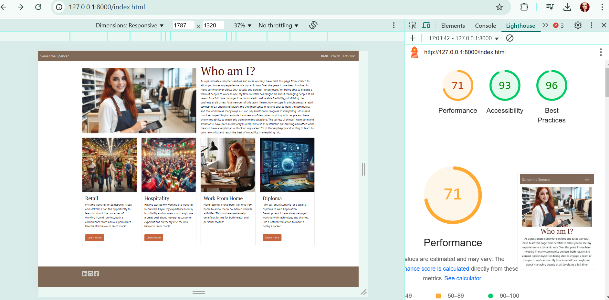

# Samantha Spencer

This page is all about me, where I've come from, what I've done, and how I can be the best candidate for your next project or job role. The page will be split into three sub-pages containing a 'Home' with my basic about information, a career page setting out what I have done up to this point, and a contact page with all my contact information and a form to ask me questions. I had originally planned on having three pages with a bonus contact page however when looking at the general flow of the site I decided it looked better to integrate the contact section into the third page. Therefore it seemed better to have an interactive option to download the PDF version of my CV for paperwork or filing for employers.

## User interactions

I would like for all of these pages to link to one another as seamlessly as possible by utilizing a nav bar to move from page to page and a footer to link to my socials and GitHub accounts. As this page is all about me most of the information will be interchangeable so I will ensure to add buttons to access other areas of the page for speed of navigation. I have also added a further element to add my CV as a PDF download to allow prospective employers to view it at their leisure. This therefore mitigated the need for a 'facts' page, making the site much simpler and clearer.

## Wireframes of all three pages of the site:

I have sketched up all three pages in mobile, tablet and monitor sizes so that there is a baseline to work from. The bulk of the text will come from my actual CV, so there will be no risk of plagiarism. I intend on using mostly AI-created images alongside some images of myself. Having adjusted the user needs of the site I can say honestly I removed the 'info' section of the contact page and made it more interactive for the user instead of repeating lots of facts.

+ 
+ 
+ 

## How to:

### Dependencies and Credits

This will be for dependencies as I go through this project - complete as they come through.
+ [Bootstrap](https://getbootstrap.com/) has been used throughout the project to add items like a navbar, a carousel, and a footer. The main reason for this is to mitigate the need for written Javascript to create a responsive site. I have annotated throughout the project, the key areas this has been used.
+ [Microsoft Create](https://create.microsoft.com/en-us/features/ai-image-generator) was used to create AI images to utilize for the Home page and some content in other areas.
+ [IMG Online](https://www.imgonline.com.ua/eng/get-dominant-colors.php) was used to pull the key colors out of the gaming.jpeg file. These colors were used to create the Root colors of the page and I made sure that they were readable colors on all screens for accessibility.
+ [Google Fonts](https://fonts.google.com/) used to import two font styles into the style.css file. Both fonts were attributed to the Root in CSS making the styles uniform across the site.
+ [Font Awesome](https://fontawesome.com/) used to import icons for social links in the footer section. Will most likely be used elsewhere too.
+ [Favicon.io](https://favicon.io/#google_vignette) used to create a simple favicon with the correct colors and fonts as used throughout the site. Then link to each page.
+ [IloveIMG.com](https://www.iloveimg.com/) was used to compress all of my images to optimize page load up.
+  This is my actual live CV, I have taken text from here and edited it accordingly.
+ [Boardwalk games project](https://github.com/14sammie41/boardwalk-games) Was used to refresh me on the basic required code, which was then heavily edited on this site.
+ [Grammarly](https://app.grammarly.com/ddocs/2742182934) was used to check and correct all of the grammar on this README file.

## Bug problems and solutions

These bugs were found as I was writing the code, not whilst testing, hence being at this point in the README file.

+ Found that the cards added from Bootstrap on my index.html page were overlapping when on an xl screen size. After doing some comparisons against my code for the Boardwalk-games project and browsing the documentation from Bootstrap I realized there was a style of `max-width: 18rem;` that had been added to the HTML. When removed the cards stopped overlapping and responded better on XL screens.
+ Found that the padding on the navbar was creating a banner effect on top and bottom in the wrong color. Attempted initially to fix it by re-writing the HTML for the navbar ensuring I hadn't missed anything, but this did not work. Then I looked on Chrome DevTools to make sure there weren't any pieces of CSS overriding my CSS and found there was an `!important` tag on the navbar background color which I needed to add to my CSS to override the Bootstrap class. This is fully annotated in the CSS file.
+ Used horizontal cards on the careers page to change it up, found that the amount of text I wanted to put in was overflowing on smaller screen sizes. Having discussed with my fellow classmates different ways to resolve the problem, we decided the most aesthetically pleasing option was to use an `overflow-scroll` rule on screen sizes over 992px so the content is scrollable rather than overflowing the card. On screens under 992px, I used grid flex box rules with media queries to force the boxes to stay horizontal until the mobile screen size at which point the images sit on top of the text rather than next to each other.
+ Wanted to add a download for my CV because it's all very well talking about what I can and can't do on a site but some businesses still want a proper CV for their files etc. Went to Google and searched how to make a button, and a download link, I found the W3 Schools page had an example of how to do so, so I read the documentation, added the code, and tested as per the testing document further on. The link is as follows: [W3 Schools download example](https://www.w3schools.com/howto/howto_html_download_link.asp).

## Source for images and text

All images below have been compressed using iloveimg.com to help with load speed on the website.

+  alt, a red-haired woman making cocktails behind a bar.
+  alt, a red-haired woman serving a family of four in a child-friendly restaurant.
+  alt, a bumblebee in a forest just coming into spring with the sun coming through the trees.
+  alt, wireframe designed by me on Balsamiq for my career page.
+  alt, wireframe designed by me on Balsamiq for my contact page (before change of design).
+  alt, a red-haired woman serving behind a till in a convenience store.
+  alt, a red-haired woman playing video games on a sofa.
+  alt, wireframe designed by me on Balsamiq for my home page.
+  alt, a busy bar during a Six Nations rugby fixture.
+  alt, a red-haired woman making cocktails behind a bar.
+  alt, a busy office environment.
+  alt, a red-haired woman programming at a desk with a laptop and a monitor.
+  alt, a monitor on a desk with multiple windows open showing different programming software.
+  alt, a monitor on a desk with multiple windows open showing different programming software (needed a different size image).
+  alt, a busy supermarket aisle at Christmas.
+  alt, a red-haired woman running a shop.
+  alt, a red-haired woman running a shop (needed a different size image).
+  alt, a red-haired woman working at a desk with a laptop and a monitor.
+  alt, a red-haired woman working at a desk with a laptop and a monitor (needed a different size image).

## Deployment process

Running the project locally:
1. Ensure you have a GitHub account [Create one here](https://docs.github.com/en/get-started/start-your-journey/creating-an-account-on-github).
2. Use Google Chrome as the best browser for this deployment.
3. Install VSCode to your computer or open the browser version [here](https://vscode.dev/).
4. Click the 'Open Remote Repository' button on the home page to clone and or edit as you wish.

To do the above you may need to follow these steps also:
1. Open the repository in GitHub [here](https://github.com/14sammie41/samantha-spencer)
2. Under the name, click 'clone or download'.
3. Once in the clone section copy the HTTP clone URL for the repository.
4. In the local IDE of your choice, open the terminal.
5. Change the current working directory to wherever you want it to be made.
6. Type `git clone`, and then paste the URL you copied in step 3.

Deployment, step-by-step guide:
+ In GitHub, first, ensure all work is committed and pushed, then go to the settings tab on GitHub, then the Pages section on the left-hand navigation.
+ Once in the Pages section on GitHub change the branch drop down to 'Main' and then click the save option.
+ Now go back to the code section of GitHub and click the deployment link on the right-hand side. (You may need to refresh the page to see the deployment link)
+ Once on the deployment page on GitHub click on the provided link and it will open up the deployed project.

## Testing

As I have been testing most aspects as I write the code for the site, I am hoping this is not going to be too much.

### Testing as a user for navigation purposes:
+ The home page is clear and responsive on all screen sizes. Also ensured all breakpoints were responsive without any glaring issues.
+ Followed naturally through to the Career page on mobile size screen and noticed the images in the cards have the corners cut on the wrong sides when stacked. Having read all of the documentation for cards and borders in [Bootstrap](https://getbootstrap.com/docs/5.3/components/card/) unfortunately, I have concluded that having already adjusted the cards further than Bootstrap recommends there isn't yet the ability to make these aspects responsive.
+ At all other screen sizes, I am happy with the responsiveness and layout on the careers page. The only other caveat with using horizontal cards from Bootstrap is that to make the images and text look cohesive on all screen sizes (mostly larger) I had to add a scroll option within the cards to allow the cards to stay at the same size. I did this using a media query and a scroll attribute.
+ Having then tested the Contact page on all screen sizes, I am happy with how it responds to changing sizes especially how well the table responds to not lose the layout. 
+ I then tested the form to contact with to ensure all the elements responded correctly. As the 'email' option is the only one with a specific type element I tried using 'samantha.spencer.com' and it responded with an 'attention' note stating it requires an @ symbol to be an email address. I also ensured when a form element is left empty it doesn't allow you to submit said form.
+ The final two tests for the contact page were to check the 'Samantha's CV' button to which I am happy to say it automatically downloads as a Chrome PDF file. Then when correctly filled in the 'Let's Go' button on the form takes you to the success.html page.
+ The success.html page shows well on all screen sizes (it's very simple so not a lot of changes) and the 'return to homepage' button does exactly that!
+ The final test for the page was the ensure the social links take you to LinkedIn, GitHub, and Facebook respectively, which they do.

### Testing with validators:
+ First validator used was [W3Schools HMTL validator](https://validator.w3.org/#validate_by_input). Expecting possibly some missed slashes, but that should be all. 
    + index.html shows no errors
    + career.html shows no errors
    + contact.html shows five errors: one because my CV file has spaces in the name; one because I have a duplicate ID of `enquiry` with a warning in relation to it; two because I forgot to change the `aria-describedby` attribute on the form element.
        + All the above fixed: my CV was renamed to remove spaces and replace with '-'; Removed the ID attribute on the `form-text` div as it was not required; changed the `aria-describedby` attribute on the name and email fields to match the element.
        + Second check completed with no errors.
    + success.html shows no errors
+ Second validator used was [W3Schools CSS Validator](https://jigsaw.w3.org/css-validator/#validate_by_input). Expecting some syntax errors as I haven't dived as deep on my CSS as I did on my HTML.
    + style.css shows no errors
+ Checked page using Chrome DevTools. Unsure what to expect, I think I have been pretty thorough with writing my code.
    + Lighthouse shows a performance score of 71, an accessibility score of 93, and a best practices score of 96.
        + Best practices show 'Browser errors were logged to the console', when investigating further it comes back to a server error and syntax error associated with 'site.webmanifest:1' Which is not what I have written, therefore I cannot edit it.
        + Accessibility shows insufficient contrast on my navbar, buttons, and footer sections. Having tested my website on a number of different screen types and sizes, I am happy to leave these as they are. The contrast is sufficient for the user's needs. In the card titles on the index page I have chosen to use 'h3' headings as the 'h2' headings would have been too large for the card items.
        + Performance shows a long load time for some images as expected, a defer offscreen images as a result of the carousel images auto loading even when not on screen, both these things will not be changed as they are only performance related and if I remove them it will take away the user interactivity of the page. An eliminate render-blocking resources error shows which is connected to the external resources I am using, for example, Bootstrap and Font Awesome, these have all been used to enable things like a functional carousel without the need for writing Javascript as we have not learned how to write Javascript yet. An error stating that images would be better in the next-gen formats is a valid error however when trying to find a conversion website I was not able to convert more than 7 for free which was not applicable to this site, therefore I have left them as fully compressed Jpeg files for the time being. This could be something I look into at a later date depending on funds. An error stating 'preconnect to required origins' showed and when investigated I realized that it required adding a number of 'rel' assets to my HTML files which I am not confident in using yet, on that basis I have left them as they are as I don't want to make adjustments to my HTML without prior knowledge of how they work. The final major error was to do with 'properly sized images', this relates to the previous error of next-gen images and so the same reasoning stands for not changing this.
        + Soft warnings when checking on the performance show the following: 'image elements do not have explicit width and height', the four images commented here are not set to have an explicit width and height to allow for screen responsive changes to the page; 'enable text compression' Once again when researching this error it involved changing HTML files in a way I am not yet confident in doing so, therefore, have left them until I learn how to use them confidently; 'serve static assets with an efficient cache policy' Again I did some research on this error and it requires edits to the cache-control response header, I wish not to change these elements until I know how to confidently. Finally, I have an error of 'Reduce unused CSS' relating to a Font Awesome link in CSS, this has to be there as it is my related link for the fonts I am using to work.
    + See below for a screenshot of my DevTools testing:
    + 

+ For all bugs I encountered whilst writing my initial code please refer to the 'bugs section' further up this page.