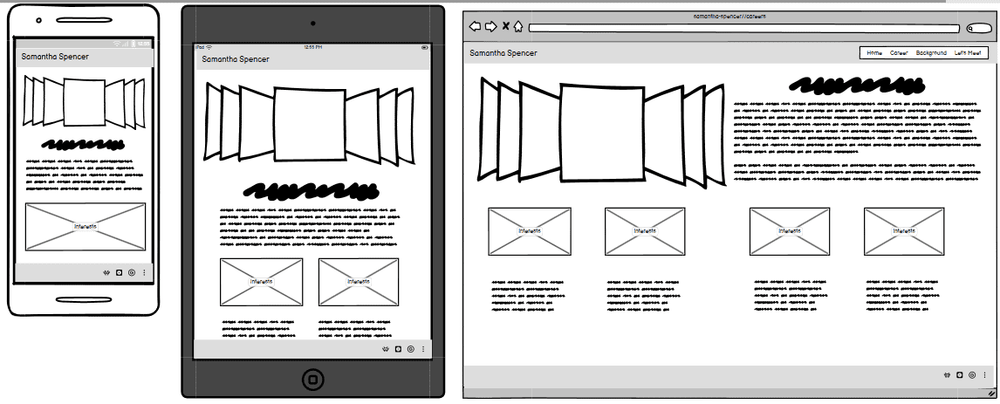

# Samantha Spencer

This page is all about me, where i've come from, what i've done and how i can be the best candidate for your next project or job role. The page will be split into three sub pages containing a 'Home' with my basic about information, a career page setting out what i have done up to this point and a contact page with all of my contact information and a form to ask me questions. I had originally planned on having three pages with a bonus contact page however when looking at the general flow of the site i decided it looked better to integrate the contact section into the third page. Therefore it seemed better to have an interactive option to download the PDF version of my CV for paperwork or filing for employers.

## User interactions

I would like for all of these pages to link into one another as seamlessly as possible by utilising a nav bar to move from page to page and a footer to link to my socials and GitHub accounts. As this page is all about me most of the information will be interchangeable so I will ensure to add buttons to access other areas of the page for speed of navigation. I have also added a further element to add my CV as a PDF download to allow for prospective employers to view it at their leisure. This therefore mitigated the need for a 'facts' page, making the site much simpler and clearer.

## Wireframes of all three pages of the site:

I have sketched up all three pages in mobile, tablet and monitor sizes so that there is a baseline to work from. The bulk of the text will come from my actual CV, so there will be no risk of plaguerism. I intend on using mostly AI created images alongside some images of myself. Having adjusted the user needs of the site I can say hoestly i removed the 'info' section of the contact page and made it more interactive for the user instead of repeating lots of facts.

+ 
+ 
+ 

## How to:

### Dependancies amd Credits

This will be for dependancies as i go through this project - complete as they come through.
+ [Bootstrap](https://getbootstrap.com/) has been used throughout the project to add items like a navbar, a carousel and a footer. The main reason for this is to mitigate the need for written Javascript to create a responsive site. I have annotated throughout the project key area's this has been used.
+ [Microsoft Create](https://create.microsoft.com/en-us/features/ai-image-generator) was used to create AI images to utilize for the Home page and some content in other areas.
+ [IMG Online](https://www.imgonline.com.ua/eng/get-dominant-colors.php) was used to pull the key colours out of the gaming.jpeg file. These colours were used to create the Root colours of the page and I made sure that they were readable colours on all screens for accessability.
+ [Google Fonts](https://fonts.google.com/) used to import two font styles into the style.css file. Both fonts were attributed to the Root in CSS making the styles uniform accross the site.
+ [Font Awesome](https://fontawesome.com/) used to import icons for social links in the footer section. Will most likely be used elsewhere too.
+ [Favicon.io](https://favicon.io/#google_vignette) used to create a simple favicon with the correct colours and fonts as used throughout the site. Then linked to each page.
+ [IloveIMG.com](https://www.iloveimg.com/) was used to compress all of my images to optimise page load up.
+  This is my actual live CV, I have taken text from here and edited it accordingly.
+ 

### Installing

Deployment, step-by-step guide:
+ 

### Executing program

Break down in bullet point commands how to execute the program as a developer - add at the end of the project

## Bug problems and solutions

Add each bug as it occurs and the solution for it.
Ensure to credit any solutions found through other developers or sites.

+ Found that the cards added from Bootstrap on my index.html page were overlapping when on an xl screen size. After doing some comparisons against my code for the Boardwalk-games project and browsing the documentation from Bootstrap i realised there was a style of max-width: 18rem; that had been added to the HTML. When removed the cards stopped overlapping and responded better on xl screens.
+ Found that the padding on the navbar was creating a banner effect on top and bottom in the wrong colour. Attempted initially to fix it by re-writing the HTML for the navbar ensuring i hadn't missed anything, this did not work. Then i looked on Chrome DevTools to make sure there weren't any pieces of CSS over-riding my CSS, confirmed there wasn't and finally looked at the bottom of Chrome DevTools to find there was basic padding of 8px on top and bottom. Adjusted the padding on CSS to 0 with my own styles.
+ Used horizontal cards on the careers page to change it up, found that the amount of text i wanted to put in was overflowing on smaller screen sizes. Having discussed with my fellow class mates about different ways to resolve the problem. We decided the most aesthtically pleasing option was to use an overflow-scroll rule on screen sizes over 992px so the content is scrollable rather than overflowing the card. On screens under 992px i used grid flex box rules with media queries to force the boxes to stay horizontal until the mobile screen size at which point the images sit on top of the text rather than next to.
+ Wanted to add a dowload for my CV because it's all very well talking about what i can and can't do on a site but some businesses still want a proper Cv for their files etc. Went to Google and searched how to make something a download link, found the W3 Schools page had an example of how to on their so read the documentation, added the code and tested as per testing document further on. Link is as follows:[W3 Schools download example](https://www.w3schools.com/howto/howto_html_download_link.asp) .

## Source for images and text

All images below have been compressed using iloveimg.com to help with load speed on the website.

+  alt, a red haired woman making cocktails behind a bar.
+  alt, a red haired woman serving a family of four in a child friendly restaurant.
+  alt, a bumblebee in a forest just coming into spring with the sun coming through the trees.
+  alt, wireframe designed by me on Balsamiq for my career page.
+  alt, wireframe designed by me on Balsamiq for my contact page (before change of design).
+  alt, a red haired woman serving behind a till in a convenience store.
+  alt, a red haired woman playing video games on a sofa.
+  alt, wireframe designed by me on Balsamiq for my home page.
+  alt, a busy bar during a six nations rugby fixture.
+  alt, a red haired woman making cocktails behind a bar.
+  alt, a busy office environment.
+  alt, a red haired woman programming at a desk with a laptop and a monitor.
+  alt, a monitor on a desk with multiple windows open showing different programming softwares.
+  alt, a monitor on a desk with multiple windows open showing different programming softwares (needed a different size image).
+  alt, a busy supermarket aisle at Christmas.
+  alt, a red haired woman running a shop.
+  alt, a red haired woman running a shop (needed a different size image).
+  alt, a red haired woman working at a desk with a laptop and a monitor.
+  alt, a red haired woman working at a desk with a laptop and a monitor (needed a different size image).

## Deployment process

Step-by-step guide to deploying the project if it was to be cloned

## Testing

This section should be large so if it is too large add a new read only file and use that for this task and then link into this page for ease of use.

-Expected
-Testing
-Result
-Fix

Link up to bug fixes here also.
